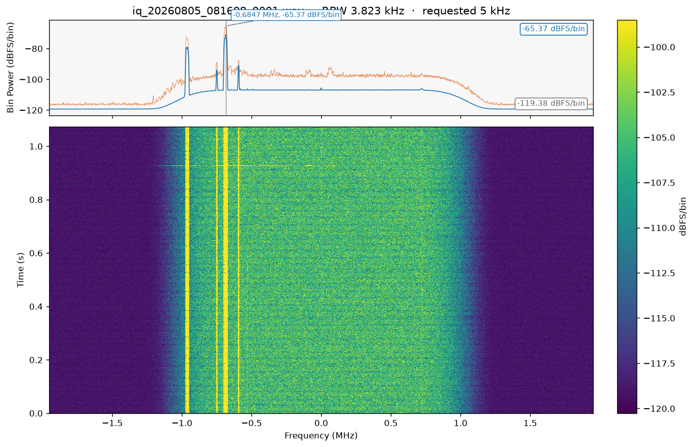

# SENSORZ IQ Spectrogram Converter

Turns a stereo IQ WAV into a PNG. I must be on the left channel and Q on the right. Mono files and ordinary audio are not supported.

The PNG has two plots that share a frequency axis, centered at 0 Hz:

- Spectrum (top): frequency vs bin power in dBFS/bin. Blue is the average. Orange is peak-hold.
- Spectrogram (bottom): frequency vs time. Color is dBFS/bin.

Large files are read in chunks, so the whole capture does not have to sit in RAM.

The CRFS IQ Recorder lives in [`crfs_iq_recorder/`](crfs_iq_recorder/). Use that app to start a recording on a sensor and download WAVE files.



## What you can do

- Convert one WAV, or every `.wav` in a folder
- Drop a file or folder onto the window
- Set RBW in Hz, or use 5 / 15 / 30 / 50 kHz
- Switch dark / light theme (remembered)
- Pick a colormap, optional frequency smoothing, and auto or manual dB range
- Watch progress, elapsed time, and ETA
- Preview the last PNG
- Run the same conversion from the command line

## Run it on this PC

You need Python 3 on PATH.

1. Double-click `Start IQ Converter.bat`.
2. The first run creates `venv` and installs `requirements.txt`. Later runs just open the GUI.

`Run_IQ_GUI.bat` starts the app without checking packages.

The launcher uses `D:\IQ Spectogram Converter\IQ Collection` (WAVs) and `D:\IQ Spectogram Converter\IQ Results` (PNGs) when drive D: is available. Folders, RBW, theme, and display options are saved in `.iq_gui_settings.json` next to the app. That file is not committed.

### Command line

After the first launcher run:

```text
venv\Scripts\python.exe iq_data.py --input path\to\file.wav --output "IQ Results" --rbw 15000
venv\Scripts\python.exe iq_data.py --folder path\to\wavs --output "IQ Results" --rbw 15000
```

Use either `--input` or `--folder`, not both. Default RBW is 15000 Hz. Optional flags: `--cmap jet|turbo|viridis|gray`, `--freq-smooth`, `--db-min`, `--db-max`.

## Build the Windows EXE

On a PC with Python:

1. Double-click `build_exe.bat`. The first build can take several minutes.
2. Run `dist\IQ_Spectrogram_Converter.exe`. You can copy that one file to another Windows PC.

The EXE is not stored in Git. Attach it to a GitHub Release when you share it.

Windows may warn on first open because the EXE is unsigned. The first launch of a one-file EXE can be slower while it unpacks.

## Files

| Path | What it is |
| --- | --- |
| `iq_gui.py` | Desktop GUI |
| `iq_data.py` | STFT and PNG conversion |
| `iq_theme.py` | Light and dark theme |
| `requirements.txt` | Python packages |
| `IQ_Spectrogram_Converter.spec` | PyInstaller config |
| `build_exe.bat` | EXE build |
| `Start IQ Converter.bat` | Create venv and launch GUI |
| `assets/` | Icons, logo, example PNG |
| `crfs_iq_recorder/` | CRFS IQ Recorder |

Packages: numpy, matplotlib, seaborn, scipy, soundfile, Pillow, and tkinterdnd2 (drag-and-drop; the GUI still opens if that import fails). Tkinter comes with a typical Windows Python install. `build_exe.bat` also installs PyInstaller.
