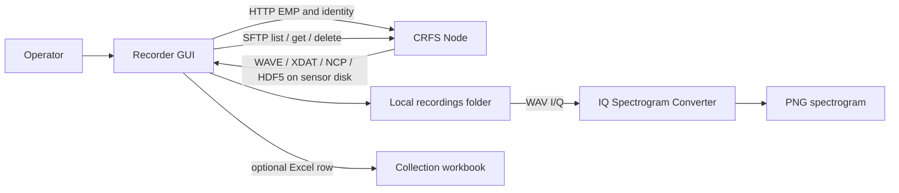
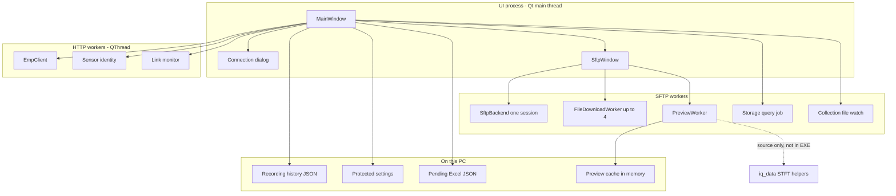
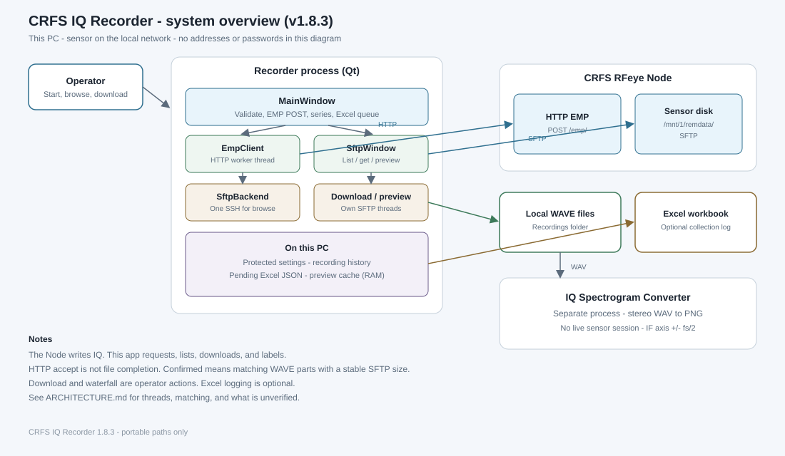
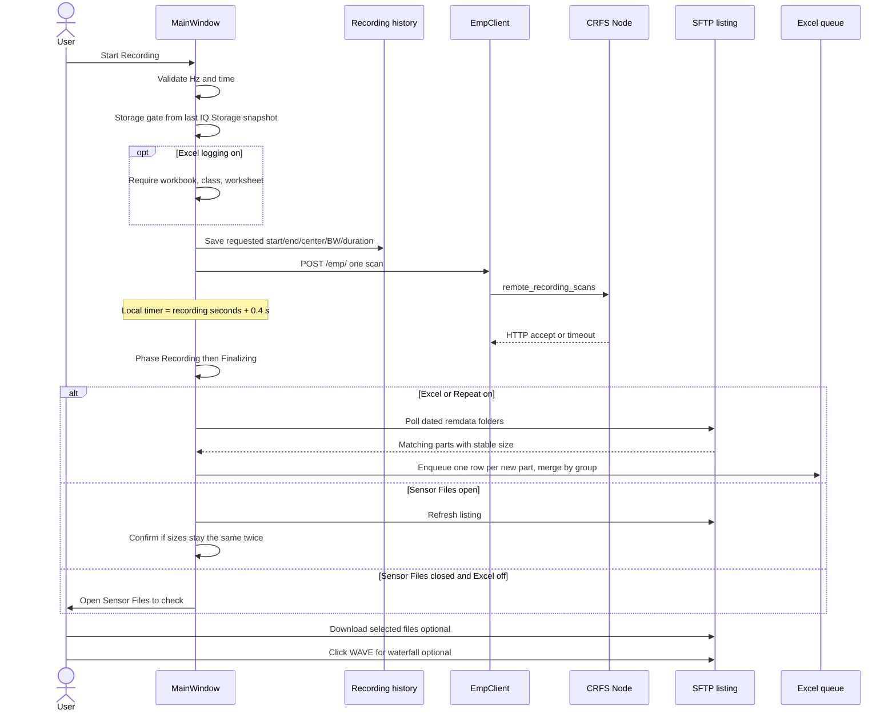
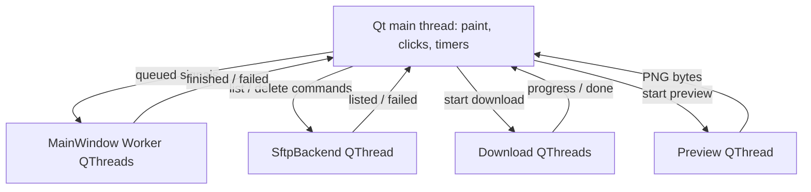
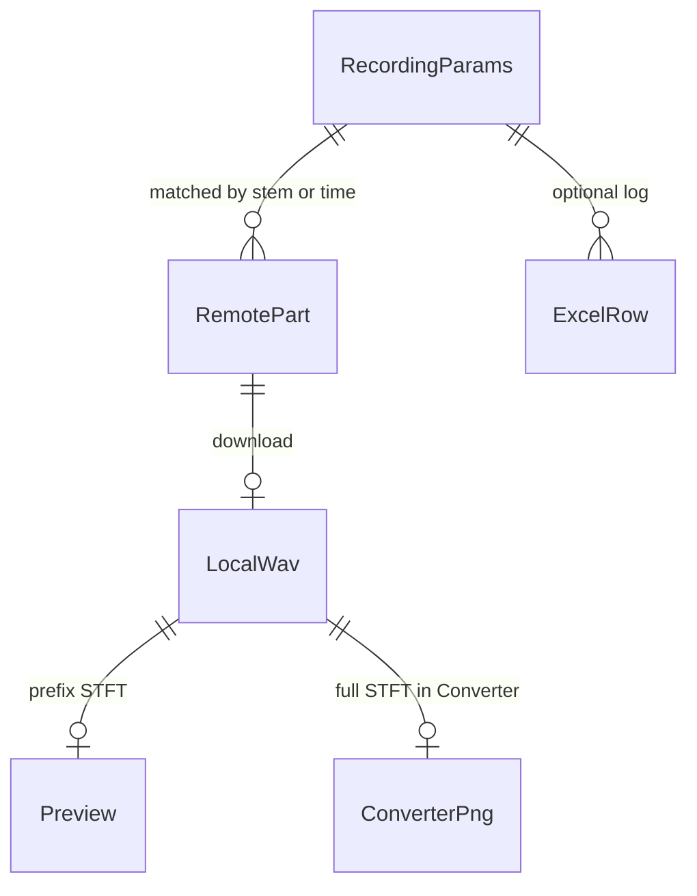

# CRFS IQ Recorder - architecture

**Version documented:** 1.8.3
**Code:** `crfs_iq_recorder/` as of this file (21 September 2026)
**Related app:** IQ Spectrogram Converter (`iq_gui.py`, `iq_data.py`) at the repository root

This note describes how the software works today. Items we could not prove from source or from a published CRFS EMP schema are listed under [Unverified](#unverified). Ideas for later work are in [Proposed improvements](#proposed-improvements) and are not current behavior.

Do not put sensor addresses, logins, or passwords in this file or in diagrams.

## System overview

CRFS IQ Recorder is a Windows desktop app. It starts an IQ capture on a CRFS RFeye Node, watches the sensor disk over SFTP, copies WAVE (or other format) files to this PC, and can append a collection row to an existing Excel workbook. It does not write IQ samples itself. The Node records; this app requests, finds, downloads, and labels.

The Converter is a separate Tk app. It turns a stereo IQ WAV (I left, Q right) into a PNG with a spectrum and a spectrogram. The two programs share a Sensorz icon and, when run from source, the Recorder's short waterfall can reuse Converter STFT helpers. They do not share a process, a settings file, or a live sensor session. The usual hand-off is a downloaded `.wav` in a local folder.

| External system | Role | How this app talks to it |
| --- | --- | --- |
| CRFS Node HTTP | Identity, connection probe, EMP recording request | `GET /`, `GET /api/node.json`, `GET /api/values/versions.json`, `POST /emp/` with HTTP Basic Auth |
| CRFS Node SFTP | File list, size, download, delete, disk free | SSH/SFTP to `/mnt/1/remdata/` (dated folders) |
| Local disk | Downloaded IQ, settings, recording history, Excel queue | Configurable recordings folder; user config under `%LOCALAPPDATA%\CRFS IQ Recorder\` for the EXE |
| Collection workbook | Field log (class, frequencies, filename, playback start) | openpyxl, or Excel COM if that workbook is already open |
| IQ Spectrogram Converter | Full PNG analysis | Offline: operator copies or points at the same WAV files |

## Component diagram

PNG copy for Confluence: [architecture-overview.png](architecture-overview.png). Mermaid source: [architecture-overview.mmd](architecture-overview.mmd).

## Component map

| Component | Responsibility | Source |
| --- | --- | --- |
| App entry | Runtime cache for the EXE; start Qt | `crfs_iq_recorder/__main__.py`, `run.py`, `paths.prepare_runtime` |
| Main window / recording controller | Band and time, Start, series, status, log, Excel toggle, Sensor Files | `gui.py` (`MainWindow`) |
| Recording phases | Idle, sending, recording, waiting for files, confirmed | `recording_status.py` |
| Log sanitizer | Strip secrets from URLs, logs, and persisted objects | `sanitizer.py` |
| Remote folders | Dated `/mnt/1/remdata/` paths | `sftp_paths.py` |
| Connection settings | Host, HTTP/SFTP logins, timeout, download folder | `connection_dialog.py`, `connection_state.py` |
| Frequency plan | Integer Hz; start/end or center/bandwidth; no silent rounding | `frequency.py`, `validation.py` |
| EMP payload | One `remote_recording_scans` item; `duration` = `rate` = `capture_length` | `request_builder.py` |
| HTTP client | Identity GETs, `POST /emp/`, connection test `GET /`, link probe | `api_client.py`, `sensor_info.py` |
| Demo HTTP | In-process fake Node; no sockets | `demo.py` |
| Size estimate | `61.051 * (BW / 10 MHz) * seconds` MB; used for the label and storage gate | `size_estimate.py`, `sensor_storage.py` |
| Link monitor | HTTP reachability every 10 s; SFTP errors stay in Sensor Files | `connection_monitor.py` |
| IQ storage | SFTP `statvfs` on `/mnt/1/remdata/`; block Start if the estimate plus margin would not fit | `sensor_storage.py` |
| Recording history | Save requested Hz/time; match remote files to that Start | `recording_history.py` |
| File watch | Stable SFTP size for split parts when Excel or Repeat is on | `file_watch.py` |
| Sensor Files window | Listing, sort, groups, download, delete, waterfall | `sftp_window.py` |
| SFTP backend | One listing thread and one SSH session for browse/delete | `sftp_window.py` (`SftpBackend`) |
| SFTP client | Paramiko connect (8 s), read (20 s), download via `.part` | `sftp_client.py`, `download_util.py` |
| Listing groups | `_0001` / `_0002` as one capture; NEW badge | `listing_sort.py` |
| Waterfall preview | First ~0.8 MB of a WAVE; STFT PNG | `spectrogram_preview.py`, `iq_wav.py` |
| Excel log | Queue, backup, merge split names, COM or openpyxl | `excel_log.py`, `excel_writer.py`, `excel_com.py` |
| Collection catalog | Workbook classes, worksheets, frequency styles | `collection_catalog.py`, `class_match.py` |
| Secrets | Windows DPAPI (`CryptProtectData`); Base64 elsewhere | `secrets_store.py` |
| Theme | Dark/light shared look | `theme.py` |
| Converter GUI | Folder pick, RBW, batch PNG | `iq_gui.py` |
| Converter DSP | Chunked STFT, spectrum + spectrogram PNG | `iq_data.py` |

## Recording workflow

Clicking **Start Recording** always builds a payload, stores history, and POSTs EMP. Confirming files, Excel, Repeat, download, and preview are separate. Download never starts by itself.

### What happens on Start

1. **Validate** - integer Hz, even bandwidth in center mode, recording time copied to `duration`, `rate`, and `capture_length`.
2. **Storage gate** - empirical estimate vs last SFTP free-space snapshot (15% or 32 MB extra). Does not delete sensor files.
3. **Excel gate** (optional) - workbook path and a unique class/worksheet mapping.
4. **History** - `RecordingParams` with the typed window, duration, host, sensor serial if known, collection fields if Excel is on.
5. **POST** - `task_id` like `iq-YYYYMMDD-HHMMSS`. Format from the combo (WAVE default).
6. **Timer** - UI phase moves to Recording. When the timer fires, HTTP is treated as finished even if the POST is still open (`client.close()`, late replies ignored).
7. **After elapsed**
   - **Collection watch** if Excel or Repeat is on: SFTP poll every 2 s; a part is "finalized" after two listings with the same size and 8 s with no growth; give up 60 s after elapsed if nothing settles.
   - **Sensor Files open**: refresh after 3 s and 12 s; confirm after 2 / 6 / 14 s if matching sizes are unchanged.
   - **Otherwise**: tell the operator to open Sensor Files. HTTP accept is not file-done.

Repeat (count or until stopped) waits after the current capture (default 5 s). **Stop after current recording** finishes that capture or cancels the countdown. Consecutive tasks are not gapless IQ.

### Independent actions

| Action | Trigger | Notes |
| --- | --- | --- |
| Sensor Files | Button | Own window and SFTP session |
| Download | Selection + Download | Up to four files at once; never overwrites (`name (2).wav`) |
| Waterfall | Click a WAVE | Prefix only; quiet start does not mean a quiet file |
| Delete remote | Delete key on the list | Sensor files only; local copies and Excel stay |
| IQ Storage | Connect, timer 30 s, after record/delete | Separate SFTP from Sensor Files |
| Link badge | Every 10 s | HTTP only |
| Excel flush | After enqueue and every 15 s | Retries if Excel has the book locked |

## Background processing

One OS process. No worker subprocess. Qt main thread owns widgets. Network and STFT run on `QThread` workers. Converter conversion (other EXE) uses a Python `threading.Thread`.

| Work | Thread | Timeout / cancel | Error handling |
| --- | --- | --- | --- |
| Paint, tables, dialogs | UI | - | - |
| EMP POST, identity, link probe | `Worker` QThread | HTTP timeout from Settings (default 30 s); link probe 4 s | Log; recording failure stops the series |
| SFTP list / mkdir probe / delete | `SftpBackend` | Connect 8 s, read 20 s; abort closes the SSH socket | Empty-state text "Could not list files" plus the error; no modal for list failure |
| Download | One QThread per file, max 4 | Cancel event; `.part` cleaned up | Status + per-file warning |
| Waterfall | QThread; matplotlib under a semaphore of 1 | Cancel; temp prefix deleted | Caption error; cache skipped |
| Collection watch / IQ Storage | `Worker` QThread, new SFTP each time | Cancel event on the previous job | Log; last good storage kept as stale |
| Excel write | UI thread calling COM or openpyxl | Busy → stay in queue | Pending count on the main window |
| Close Sensor Files | UI returns at once | Workers kept until `finished` | Late preview results dropped by token |

**Shared resources that can stall the UI**

- Matplotlib is serialized (`_PREVIEW_COMPUTE`). A preview still should not run on the UI thread.
- Sensor Files listing uses one Paramiko session. A slow `listdir` blocks other list/delete commands on that same backend thread, not the UI.
- IQ Storage and collection watch each open **another** SSH session. Several connects at once can slow the Node or hit the 8 s connect timeout (that is what "SFTP connection failed: timed out" is).
- EMP POST close-on-timer avoids waiting for HTTP, but a stuck TCP send is not fully characterized here ([Unverified](#unverified)).
- Excel COM runs on the UI thread. A hung Excel automation call would freeze the window until it returns.

Tokens (`_record_gen`, `_info_token`, `_link_token`, `_watch_token`, `_storage_token`, `_preview_token`) drop late results after a new action.

## Data and metadata

There is no CRFS WAVE RF chunk in the files we have inspected for this app. Labeling comes from **this PC's history**, matched onto remote names.

| Object | Identity | What it stores |
| --- | --- | --- |
| Recording task | UUID `id`; `task_id` on the Node is separate (`iq-YYYYMMDD-HHMMSS`) | Requested start/end/center/bandwidth Hz, duration s, host, `started_at`, optional class/worksheet/sensor serial |
| File part | Remote path, e.g. `.../file_122236_0001.wav` | Size, mtime from SFTP; `_0001` is a size split, not a frequency tile |
| Group | `iq_group_key(name)` (stem without `_NNNN`) | All parts of one capture; parent row in Sensor Files; one Excel row |
| Excel row | `sensor_id` + remote path (and group merge) | Typed Freq Start/Stop, class, filenames, Playback Start as `N seconds` |
| Preview | `(path, size, mtime)` | Last 8 PNGs in that Sensor Files window |

**Requested vs recorded**

- **Requested:** values on Start (and in history, Sensor Files columns, Excel Freq Start/Stop). The EMP `bandwidth` field is sent as typed. 1.8.3 does not clamp it to instantaneous bandwidth.
- **Verified on disk:** WAVE `fmt` sample rate and byte length after download or preview. The waterfall X axis is baseband `±fs/2`, not the typed MHz window, unless the operator reads the history columns.
- **Class band** in the workbook is wider than one capture. Excel is filled with the **typed capture window**, not the whole class.

Matching: prefer a remembered `iq_stem`; otherwise the lead part's timestamp must fall in `[started_at - 180 s, started_at + duration + 180 s]`. One recording maps to at most one group. Host is a weak preference so an IP change does not drop metadata.

## Persistence and recovery

| Store | Location (EXE) | Location (source) | Survives restart |
| --- | --- | --- | --- |
| Settings + DPAPI secrets | `%LOCALAPPDATA%\CRFS IQ Recorder\.crfs_iq_recorder_settings.json` | next to `crfs_iq_recorder/` | Yes. Plaintext password keys are stripped on load. |
| Recording history | `.crfs_iq_recorder_recordings.json` in the same folder | same pattern | Yes, last 2000 rows. No passwords. |
| Excel queue + logged keys | `.crfs_iq_recorder_excel_log.json` | same | Yes. Flush on a 15 s timer and at startup. |
| Workbook backup | `*.crfs-backup-*` next to the `.xlsm` | same | Yes, before the first write |
| Downloads | Settings folder, default `%USERPROFILE%\CRFS IQ Recorder\Recordings` | configurable; cloud paths remapped to local | Yes |
| Preview cache | Memory in `SftpWindow` | - | No |
| Matplotlib cache | `%LOCALAPPDATA%\CRFS IQ Recorder\cache\matplotlib` | unused unless frozen | Yes |
| Converter settings | `.iq_gui_settings.json` next to the Converter | same | Separate app |
| Demo SFTP | In-memory | - | No |

After a disconnect: the header goes Checking, then Reconnecting... (one missed HTTP check), then Disconnected (two). It returns to Connected when probe succeeds. SFTP timeouts stay in Sensor Files. Reopening Sensor Files starts a new SSH session. Pending Excel rows retry until the workbook is writable. History still matches files after an IP change if stems or timestamps line up.

Crash during download leaves a `.part` file; the next successful download finalizes a unique name.

## Converter integration

| | Recorder preview | Converter |
| --- | --- | --- |
| App | Same EXE, Sensor Files pane | Separate EXE / `iq_gui.py` |
| Input | SFTP prefix, max 786,432 bytes, 131,072 samples | Whole WAV, chunked |
| Plot | Waterfall only, 256-point FFT, jet | Spectrum + spectrogram, RBW-based FFT |
| Axis | Baseband `±fs/2` | Same IF axis (not EMP MHz) |
| Shared code | Imports `iq_data` helpers when **not** frozen; EXE uses a local STFT copy | `iq_data.py` |

Typical field path: Recorder download folder → copy or save into the Converter input folder (this repo's launchers use `IQ Collection` / `IQ Results` next to the Converter). Folders are settings, not hardcoded drive letters in shared code.

## Build and distribution

**Recorder**

1. `build_exe.bat` creates `.venv`, installs `requirements.txt` and PyInstaller, runs `CRFS_IQ_Recorder.spec`.
2. One-file windowed EXE: `crfs_iq_recorder/dist/CRFS_IQ_Recorder.exe`. Entry `run.py`. Runtime hook `pyi_rth_crfs.py`.
3. Git does not store the EXE. Tag `vX.Y.Z` must match `__version__` in `crfs_iq_recorder/__init__.py` and Quick Start **Version**.
4. GitHub Release on `ItayHararii/iq-spectrogram-converter` holds the EXE. Older tags stay for rollback. This branch publishes with remote `personal`. Do not force-push `main` or tags.

**Converter**

- `build_exe.bat` at the repo root and `IQ_Spectrogram_Converter.spec` → `dist/IQ_Spectrogram_Converter.exe`.
- Converter version is `__version__` in `iq_gui.py` (1.3.0 at the time of this note).

Never commit credentials, `*.wav`, collection workbooks, Excel backups, or EXEs.

## Unverified

- EMP JSON response body and any completion or cancel URL. Public CRFS docs and the in-repo research note do not define them. This app does not call `/emp/status`.
- Meaning of EMP `rate` and `capture_length` beyond "same number as recording seconds" as sent.
- Whether the Node records the full requested RF span when it is wider than instantaneous bandwidth. History and Excel still store the request. WAVE `fs` is the way to see what was stored.
- Exact analog 3 dB IBW vs datasheet 40 / 100 MHz.
- XDAT / NCP / HDF5 on-disk layout and sample rate vs WAVE.
- Whether Site or DeepView plots EMP `bandwidth` as the waterfall axis for these WAVE files.
- That `requests` always honors the Settings timeout on a blocked EMP POST (scripted POSTs have hung in lab use).
- SFTP account names on a given Node (HTTP and SFTP are different logins; defaults exist in code and must not be pasted into shared docs).

## Proposed improvements

Not implemented. Highest value first for responsiveness, then reliability, then maintainability.

1. **One SFTP client for browse, storage, and watch** - or a short queue. Parallel connects are the main timeout we see in Sensor Files.
2. **Keep EMP POST off the UI path and bound the socket** - timer already closes the client; confirm the send cannot block a worker forever.
3. **Show requested vs recorded coverage** - keep the POST as typed; label estimate, Sensor Files, Excel, and waterfall from WAVE `fs` / model IBW when they differ.
4. **Replace the 61.051 MB rule** with the measured WAVE DDC bins so storage gating matches file size.
5. **Excel writes off the UI thread** with the same pending file.
6. **Bundle Converter STFT in the Recorder EXE** so preview matches Converter in frozen builds.
7. **Drop unused listing thread work when the window is hidden**; cap preview jobs at one in flight (already one matplotlib lock).
8. **Document WAVE-only preview** in the UI when the format is not WAVE.

Lab scripts under `crfs_iq_recorder/tools/` are not part of the product EXE and are not this architecture.
