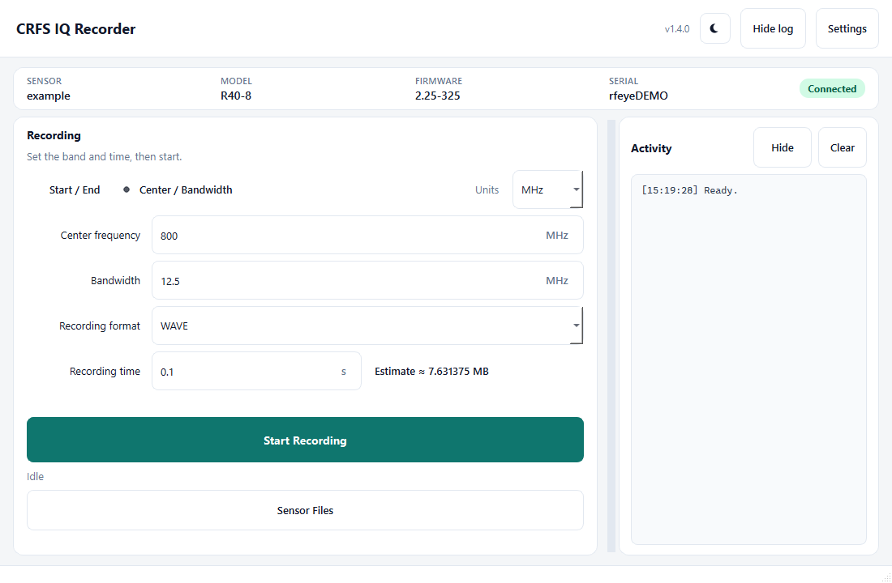
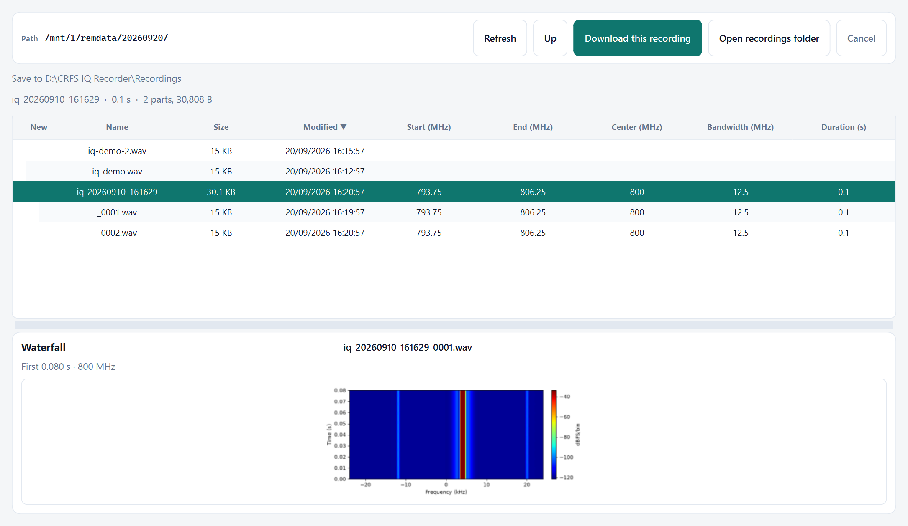
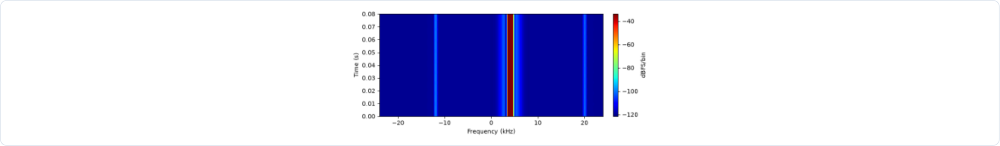

# CRFS IQ Recorder - Quick Start Guide

CRFS IQ Recorder is a Windows app for CRFS sensors. It starts an IQ recording, downloads the WAVE files to this computer, and shows a short waterfall preview so you can check that a signal was captured.

## Download and run

**Version:** 1.8.1
**File:** `CRFS_IQ_Recorder.exe` - one file, no Python, no install.

> Windows EXE: [CRFS IQ Recorder 1.8.1](https://github.com/ItayHararii/iq-spectrogram-converter/releases/tag/v1.8.1)

1. Save the exe on this PC (Desktop or a local folder).
2. Double-click **CRFS_IQ_Recorder.exe**. The first launch can be slower.
3. This computer must be able to reach the sensor on the network.

If Windows SmartScreen appears, choose **More info -> Run anyway** for this internal build.

Do not put real sensor IPs, logins, or passwords on this page or in screenshots.

## Record IQ

1. Open **Settings** and enter the sensor IP, HTTP login, and SFTP login.
2. Check **Model**, **Firmware**, **Serial**, and **Status** in the header. Status should read **Connected**.
3. Choose **Start / End** or **Center / Bandwidth** (values in MHz).
4. Enter **Recording time (s)** and check **Estimate**.
5. Click **Start Recording**. Status goes **Sending request...**, then **Recording...**, then **WAVE file found** when files appear.

To log into a collection workbook: tick **Log recordings to Excel**, choose the `.xlsm` file, and check the collection event and target class. When a recording finishes, the app adds that capture to the Excel log automatically (class, frequencies, filename, and Playback Start as `N seconds`). Split parts stay on the same row.

Repeat count or Until stopped runs consecutive recordings, with a wait between them (default 5 seconds). **Stop after current recording** finishes the capture that is already running, or cancels the countdown, and does not start another.

HTTP and SFTP logins are remembered on this computer. In Sensor Files, select files and press Delete to remove them from the sensor.

*Main window - band and time, Log recordings to Excel, Start Recording, and Sensor Files.*

## Find and download recordings

1. Click **Sensor Files**.
2. Today's folder on the sensor opens (`/mnt/1/remdata/YYYYMMDD/`). New files show **NEW**. A split capture appears as a collapsible parent such as `iq_20260915_142718`, with `_0001.wav` and `_0002.wav` underneath. Single files stay as normal rows.
3. Start, end, center, bandwidth, and duration are shown when the app has them. The parent shows part count and combined size.
4. Select the parent and click **Download this recording** for every listed part, or select individual children to download only those files. There is no save dialog. Delete is keyboard-only on the focused file list.

Default local folder: `D:\CRFS IQ Recorder\Recordings` (or `%USERPROFILE%\CRFS IQ Recorder\Recordings` if drive D: is not available)

The main window shows **IQ Storage** for the sensor disk that holds `/mnt/1/remdata/`. It refreshes on connect, while connected, and after a recording or a remote delete. Under 10% free is a yellow warning; under 5% is red. A recording that would not fit, including a safety margin, is blocked. Existing files are never deleted to free space.

Change it in **Settings -> Download folder**. The choice is remembered. Files stay on this PC (not OneDrive or other cloud folders).

*Sensor Files - file list, recording details, Download, and the local save path.*

## Preview the captured signal

Click a WAVE file. A short waterfall of the first portion appears under the list (frequency on X, time on Y, color in dBFS/bin). Use it as a quick visual check.

*Waterfall preview of the selected IQ file - a short overview, not a full analysis.*

## Useful notes

- Recordings are saved on the sensor first. **Download** copies them to this computer.
- Today's sensor folder is created after the first recording task is submitted.
- Large recordings may be split into numbered files. The parent row represents the whole capture; download or delete that parent if you need every listed part.
- With Excel logging on, each finished recording is added to the workbook automatically.
- The waterfall preview is a short overview of the start of the file.
